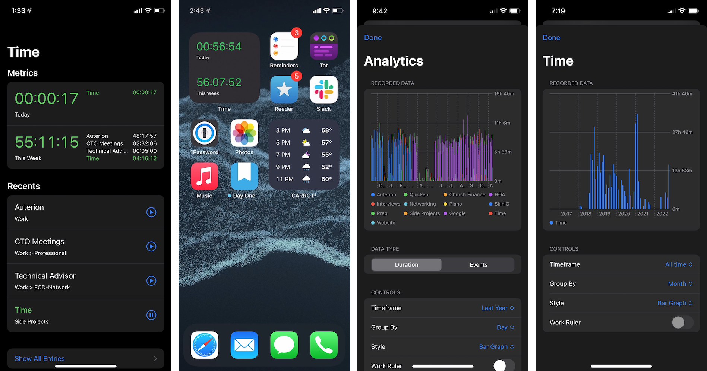

# Time-Client

  

## Motivation

_Time_ is a time tracking application designed around flexible organization of
how time is tracked and easy reporting on where time was spent.

This application was built in response to an analysis I did in [2017][2017]
using data recorded in a contractor-focused time tracker and is largely a
correction from concerns that I had with how that software organized and
stored data.

## Screenshots

## Highlighted Features

* **Flexible data organization**
  * Categories used to track time entries have no max or minimum depth
  * Everything can be nested, or rearranged at will
* **Fast analytics based around aggregate time**
  * Default view shows total time per category today, and this week
  * Historical data can be viewed by day, week, month and year
  * Grouped category trees or singular leaf nodes can both be graphed
  * Handles DST and entries that wrap day boundaries well
* **iOS Widgets**
  * A live timer shows today and this week's time on the homescreen
* **Timezone support**
  * All time entries are recorded in the user's current locale by default
  * No locks between start and end timezone -- all can be edited
  * Reporting based around the timezone as perceived as well as any reference
    timezone
* **Simplicity**
  * Import/export everything with wizards
  * Analytics and category organization are both 1st class features
  * Single click to any feature
  * Edit everything

## Blog Posts

* 10/20 - [Time Tracking](https://nathantornquist.com/blog/2020/10/time-tracking/)
* 10/20 - [Is my timer running?](https://nathantornquist.com/blog/2020/10/is-my-timer-running/)
* 10/20 - [Building a Realtime Widget](https://nathantornquist.com/blog/2020/10/building-a-realtime-widget/)
* 05/21 - [SwiftUI as a Design Tool](https://nathantornquist.com/blog/2021/05/swiftui-as-a-design-tool/)
* 11/22 - [Finishing Time](https://nathantornquist.com/blog/2022/11/finishing-time/)

## Source Code

* [Time-Client (this repo)](https://github.com/Tornquist/Time-Client)
* [Time-API](https://github.com/Tornquist/Time-API)
* [Time-Core](https://github.com/Tornquist/Time-Core)

[2017]: https://nathantornquist.com/blog/2018/02/2017-work-analysis/
